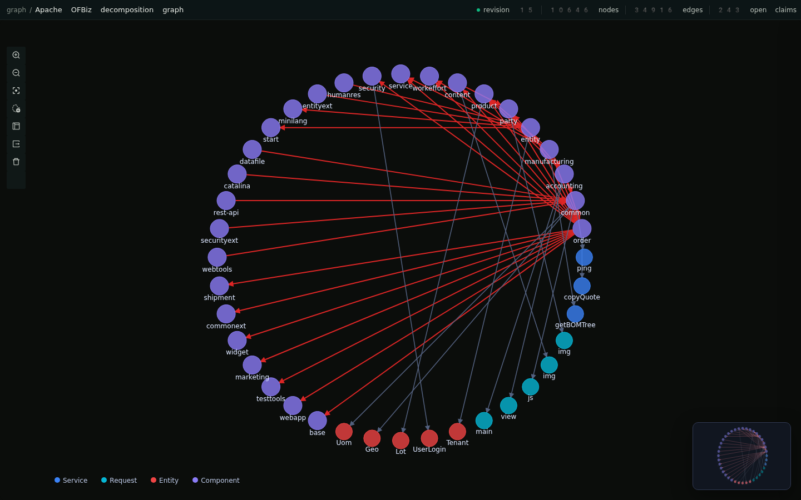

# Trestle

**A knowledge-graph harness for code migration.** Trestle turns a legacy
estate into a typed, evidence-backed graph that coding agents and humans
can query while planning and executing a migration.

The context in this codebase helps you and your agent define the vocabulary for your knowledge graph schema (‘profiles.ts’). It then helps you select the proper AST producer or language specific parser (’extract/pipeline.ts’) to extract the raw facts. Finally in (‘resolvers/*.ts’) you define the mappings between raw facts and your vocabulary to construct the graph.



<sub>A 40-node view centered on `order` from an Apache OFBiz dogfood graph
with 10,646 nodes and 34,916 evidence-backed edges.</sub>

- **Evidence on every edge.** Each edge cites the facts (file + location)
  that justify it and the rule that produced it.
- **Designed for Agents.** The repo ships `AGENTS.md` and skills that make setup super easy. Just ask the agent what to do next and it will walk you through the steps to bootstrap a graph.

## Requirements

- Node.js **≥ 23.6** (native TypeScript execution and `node:sqlite`)
- Git
- Optional: [`@ladybugdb/core`](https://www.npmjs.com/package/@ladybugdb/core)
  for the Cypher projection (`project build`/`project query`)

## How it works

Three files at the root define a graph. Each is ordinary TypeScript.

**`profile.ts`** — the vocabulary: node kinds with identities, edge kinds
with endpoints, and the fact kinds the pipeline may emit.

```ts
import { defineProfile, t } from "trestle";

export default defineProfile({
  nodes: {
    Program: { identity: ["name"] },
    Dataset: { identity: ["name"] },
  },
  edges: {
    WRITES: { from: ["Program"], to: ["Dataset"], props: { ddName: t.string().optional() } },
  },
  facts: {
    "binding-observed": { version: 1, props: { program: t.string(), ddName: t.string() } },
  },
});
```

**`extract/pipeline.ts`** — transcription. It reads the corpus and emits
facts with source locations. It never infers; joining is the resolvers'
job. Cells are memoized on their inputs, so re-extraction is incremental.

```ts
import { pipeline } from "trestle";

export default pipeline(async ({ corpus, memo, emit }) => {
  for (const path of corpus.list(".cbl")) {
    await memo(`cobol:${path}`, [path], () => {
      const text = corpus.read(path);
      for (const m of text.matchAll(/SELECT\s+(\w+)\s+ASSIGN\s+TO\s+(\w+)/g)) {
        emit({ kind: "binding-observed", sourcePath: path,
               locator: { type: "lines", startLine: lineAt(text, m.index) },
               props: { program: programOf(text), ddName: m[2]! } });
      }
    });
  }
});
```

**`resolvers/*.ts`** — inference. Resolvers run in phase order, join facts
into nodes and edges, cite evidence from both sides of every join, and
raise claims for what they cannot match.

```ts
import { resolver } from "trestle";

export default resolver({
  name: "dd-resolution",
  phase: 20,
  consumes: { facts: ["binding-observed", "dd-card-observed"] },
  run(slice, emit) {
    const dds = slice.index("dd-card-observed", (f) => [f.props.ddName as string]);
    for (const fc of slice.facts("binding-observed")) {
      const matches = dds.get([fc.props.ddName as string]);
      if (matches.length === 0) {
        emit.claim("unallocated-dd", {
          about: [`Program:${fc.props.program}`],
          detail: `ASSIGN TO ${fc.props.ddName} is never allocated by a DD card`,
          rule: "unmatched-assign",
        });
        continue;
      }
      for (const dd of matches) {
        emit.edge("WRITES",
          { from: `Program:${fc.props.program}`, to: `Dataset:${dd.props.dataset}` },
          { evidence: [fc, dd], rule: "assign-to-dd" });
      }
    }
  },
});
```

Then loop: edit, `extract`, `resolve`, read `survey`, repeat. The survey
ranks unresolved populations so the next resolver to write is obvious.

Parsers are your choice. The pipeline can shell out to compilers, indexers
(SCIP, ctags), tree-sitter, or hand-written column-aware readers for
formats no modern tool handles; all of them are just fact emitters. The
`extraction` skill includes a tool-selection index by language.

## Working with coding agents

Trestle is designed to be driven by an agent. The repo ships:

- [`AGENTS.md`](./AGENTS.md) — the loop and the rules (transcribe vs.
  infer, evidence discipline, never edit `corpora/`).
- [`.agents/skills/`](./.agents/skills) — `profiles`, `extraction`,
  `resolvers`, `loop`: task-specific guidance the agent loads before
  touching each surface.
- [`.agents/setup`](./.agents/setup) — environment bootstrap, run
  automatically by Amp orbs.
- [`.amp/services.yaml`](./.amp/services.yaml) — declares `trestle serve` as
  a supervised service with a portal, so a graph is one command away.
- [`.amp/plugins/trestle.ts`](./.amp/plugins/trestle.ts) — `trestle_auth`,
  `trestle_query`, `trestle_call` tools for querying a served graph from
  other threads.

Point an agent at a fresh fork with a corpus added and ask it to build the
graph. That is how every case study was produced.

## Querying and serving

`trestle serve` exposes the live graph three ways from one process:

- **`/`** — an interactive [G6VP](https://github.com/antvis/G6VP) explorer
  reading the SQLite store directly (reflects the latest `resolve` on
  refresh).
- **`/mcp`** — an MCP server (`graph_query` and friends) that any MCP client
  can attach to.
- **`/api/query`** — Cypher over the optional LadybugDB projection.

Presentation lives in `trestle.config.ts`:

```ts
export default {
  corpusRoots: ["corpora"],
  visualization: {
    title: "Migration knowledge graph",
    nodes: { Program: { label: "name", color: "#9b87f5" } },
    edges: { CALLS: { color: "#42b7ff", width: 1.25 } },
  },
} satisfies TrestleConfig;
```

## Corpora

Estates live under `corpora/` and are never edited.

```sh
npx trestle corpus add <git-url> [name] [--ref <branch|tag|sha>]   # shallow submodule
npx trestle corpus add <archive-url> [name] [--sha256 <hash>]      # .tar.gz/.zip, manifest committed
npx trestle corpus restore                                          # refetch archive corpora
```

Git corpora are pinned by submodule SHA; archive corpora are pinned by a
committed `corpora/<name>.source.json` manifest. Neither commits corpus
bytes to your graph repo.

## Upgrading

Git is the distribution channel.

```sh
git remote add upstream https://github.com/ampcode/trestle   # once
git fetch upstream && git merge upstream/main
```

Engine code lives in `src/`; your profile, pipeline, resolvers, and corpora
live beside it and rarely conflict.

## License

[Apache-2.0](./LICENSE)
